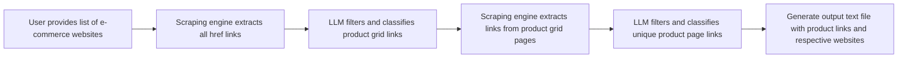

# LinkSniffer 🌐

**An AI-powered crawling engine designed to efficiently fetch and aggregate product URLs from multiple e-commerce websites.**

---

## Table of Contents
- [Workflow](#workflow)
- [Features](#features)
- [Installation](#installation)
- [Usage](#usage)
- [Contributing and Future Work](#contributing-and-future-work)

---

## Workflow



---

## Features

- **AI-Powered Crawling:** Uses Large Language Models (LLMs) to filter and classify product links.
- **Efficient Workflow:** Streamlined asynchronous pipeline for extracting and aggregating product URLs.
- **Scalable Infrastructure:** Supports running locally, in Docker containers, or with GPUs for LLMs.

---

## Installation

### 1. Clone the Repository

```bash
git clone https://github.com/HARISH-VARMA-GIT/LinkSniffer.git
cd LinkSniffer
```

### 2. Configure Environment Variables

1. Rename `.env.example` to `.env`.  
2. Add your OpenAI API key if you plan to use OpenAI models.  
3. Ensure only one model provider is active at a time by setting others to `false` in the `.env` file.

### 3. Running in a Docker Container  

**Prerequisites:**  
- Docker and Docker Desktop installed.  

#### Running Ollama (For Local LLM Models)  

If you have GPUs and want to run LLM models locally, use the following commands:

```bash
docker run -d --gpus=all -v ollama:/root/.ollama -p 11434:11434 --name ollama ollama/ollama
docker exec -it ollama ollama pull llama3.1
```

#### Running the Crawler Engine  

Replace `PATH_LINK_SNIFFER` with your folder's absolute path:

```bash
docker build -t scraper .
docker run -it -v PATH_LINK_SNIFFER:/project scraper
```

### 4. Running in a Local Environment (Optional)  

**Prerequisites:**  
- [Google Chrome](https://www.google.com/chrome/) and [ChromeDriver](https://chromedriver.chromium.org/downloads).  
- Python installed (3.10+ recommended).  

#### Create a Virtual Environment  

Instead of the usual `venv`, we use `uv`, a fast Python package manager built in Rust:  

```bash
pip install uv
uv venv --python 3.10
```

Activate the virtual environment by following the command output from the previous step.

#### Install Dependencies  

```bash
uv pip install -r requirements.txt
```

#### Start the Crawler Engine  

```bash
uv run app/main.py
```

---

## Usage

1. Add your list of e-commerce website URLs to the input file located in `app/helpers/url_list.py`.  
2. Run the crawler engine.  
3. The system will output a text file containing classified product URLs grouped by their respective websites.  

---

## Contributing and Future Work

Following are the features that are encouraged for contributing

1. Support for Additional Model Providers: Extend the functionality by integrating support for additional model providers, such as Groq, Nvidia, and Gemini, to broaden the scope and versatility of the platform.

2. Batch Job API for URL Extraction: Develop an API that facilitates the execution of batch jobs for efficiently extracting URLs, streamlining processing for large datasets.

3. Database Integration for Output Storage: Modify the output handling mechanism to support storing results directly in a database, providing better scalability and easier data management compared to traditional text files.

4. Prompt Optimization and Refinement: Improve the prompt structure and its handling to achieve more accurate, contextually relevant, and efficient responses from the system.

---

**Happy Crawling with LinkSniffer!** 

---
